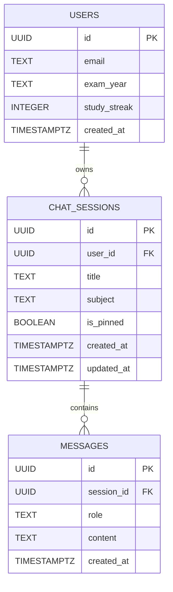

# Product Requirements Document (PRD)

# 📘 JEE AI ("Bhaiya AI") — AI-Powered Entrance Exam Preparation Assistant

| **Document Version** | 1.0.0 |
|---|---|
| **Product Name** | JEE AI / Bhaiya AI |
| **Document Status** | Approved / Production Baseline |
| **Target Launch** | Academic Year 2025–2026 |
| **Owner / Lead Author** | Vedant ([@Vedant1922](https://github.com/Vedant1922)) |
| **Target Audience** | Engineering Team, Product Designers, EdTech Stakeholders |

---

## 1. Executive Summary & Vision

### 1.1 Product Vision
**JEE AI** is a specialized, conversational AI learning companion engineered to empower students preparing for India's most competitive engineering entrance exams: **IIT-JEE (Main & Advanced)**. 

Unlike generic conversational models that provide broad, textbook-level or college-level explanations, JEE AI functions as **"Bhaiya"** (an affectionate Hindi term for "Elder Brother") — an elite IITian mentor who has cracked the exam, knows the precise NCERT syllabus boundaries, points out recurring "JEE Traps", provides memory shortcuts, and motivates the student during stressful study sessions.

### 1.2 Core Value Proposition
1. **Syllabus-Grounded Accuracy (RAG)**: Zero irrelevant college-level theory; explanations strictly adhere to high-yield JEE concepts.
2. **Lightning-Fast Streaming**: Sub-second initial response latency via Server-Sent Events (SSE).
3. **Flawless Scientific Formatting**: First-class LaTeX mathematical formulas and chemical equations rendered in real time.
4. **Relatable & Inspiring Mentorship**: Personalized peer-to-peer tone that reduces preparation burnout.
5. **Affordable & Accessible**: High-quality guidance available 24/7 at a fraction of Kota coaching costs.

---

## 2. Problem Statement & Market Opportunity

### 2.1 The Problem
- **Astronomical Coaching Costs**: Over 1.4 million students register for JEE each year. Offline coaching hubs (Kota, Delhi, Hyderabad) charge between ₹1,50,000 to ₹3,50,000 ($1,800 to $4,200) annually, excluding hostel expenses.
- **Large Batch Sizes & Doubt Bottlenecks**: Batch sizes in offline and large online coaching institutes typically range from 80 to 250 students. Shy students frequently carry unresolved doubts home.
- **Flaws in Vanilla LLMs (ChatGPT, Claude, Gemini Web)**:
  - *Hallucination / Scope Drift*: When asked a basic organic mechanism question, general models often quote advanced university graduate mechanisms not recognized by the JEE examination board.
  - *Lack of Exam Context*: General models fail to alert students to standard negative marking traps or standard JEE shortcuts.
  - *Poor Formula Formatting*: Math and chemical symbols often appear as raw LaTeX strings (`\frac{d^2y}{dx^2}`) rather than formatted interactive math.
- **High Study Burnout & Isolation**: Aspirants study 10–14 hours daily; the lack of a companion or mentor creates immense mental stress.

### 2.2 Market Opportunity
An accessible, high-performance web platform that bridges the gap between static textbooks and an expensive 1-on-1 tutor. By utilizing an optimized **AI Router + Local Syllabus RAG** architecture, the system provides top-tier answers at negligible API inference costs.

---

## 3. Target User Personas

### Persona 1: "Rohan" — The Dedicated Aspirant (Class 12 / Dropper)
- **Profile**: 17–18 years old, studying in a coaching institute or online batch.
- **Core Pain Point**: Solves PYQs (Previous Year Questions) late at night (11:00 PM – 2:00 AM). When stuck on an Electrochemistry or Kinetics problem, no teachers or peers are available to help.
- **Needs**: Instant step-by-step breakdown, formula verification, identification of why his chosen answer was a trick option.

### Persona 2: "Ananya" — The Tier-2/3 City Self-Studier
- **Profile**: 16 years old, preparing from home using YouTube lectures and standard reference books (HC Verma, OP Tandon, MS Chouhan).
- **Core Pain Point**: Overwhelmed by massive textbooks; cannot determine what is high-yield for JEE Main vs what is out of syllabus.
- **Needs**: Conceptual clarity in simple terms with analogies, positive encouragement, and quick tips to solve problems under 2 minutes.

---

## 4. Product Scope & Roadmap Phasing

### Phase 1: MVP / Current Production Version (In Scope)
- Responsive React 19 + Tailwind CSS web interface.
- Complete Supabase authentication (sign up, login, user persistence).
- Two-Tier AI Architecture (GPT-4o-mini intent router + syllabus context injector).
- Real-time token streaming via Server-Sent Events (SSE).
- LaTeX rendering with KaTeX and `rehype-katex` support.
- 16 high-yield JEE Chemistry units stored in curated local text vaults.
- Multi-session chat history, auto-titling, chat pinning, and session deletion.
- Exam countdown timer and streak tracker.

### Phase 2: Planned Enhancements (Near-Term)
- Zero-cost flowcharts and diagrams using Mermaid.js syntax.
- Expansion of syllabus vaults to include JEE Physics and Mathematics modules.
- Multi-modal support: upload image of a printed textbook question.
- Adaptive PYQ (Previous Year Questions) quiz generator.

### Phase 3: Long-Term Horizon (Multi-Exam Platform)
- Multi-tenant exam scaling: Support for NEET (Medical), CUET, and Foundation.
- Dynamic persona switching (e.g., "Doctor Didi" for NEET, "IITian Bhaiya" for JEE).
- Audio speech-to-text and voice mentoring output.

---

## 5. Functional Requirements (FR)

### FR-1: Authentication & User Profile Management
- **FR-1.1**: The system shall allow users to register and sign in using Email and Password via Supabase Auth.
- **FR-1.2**: On initial login, the system shall prompt the user to select their target exam year (e.g., 2025, 2026, 2027) and persist this to the `users` table.
- **FR-1.3**: The user profile shall maintain a continuous `study_streak` count and track `last_active_date`.

### FR-2: Intelligent AI Query Routing
- **FR-2.1**: The backend shall inspect incoming student queries using an ultra-low-latency classifier prompt (`temperature: 0`, `max_tokens: 20`).
- **FR-2.2**: The router shall categorize the input into one of the 16 recognized syllabus filenames (e.g., `chem_unit4_thermodynamics`) or return `GENERAL`.
- **FR-2.3**: If the query is conversational (e.g., "How do I manage time?", "Hello"), the router shall output `GENERAL` without loading heavy domain documents.

### FR-3: Syllabus Knowledge Retrieval (RAG)
- **FR-3.1**: When a syllabus category is identified, the backend shall synchronously load the corresponding verified note file from `syllabus_docs/`.
- **FR-3.2**: The loaded notes shall be appended to the system instructions under an explicit boundary header: `Prefer and align your explanation with the following JEE study material. Stay exam-focused and avoid unnecessary advanced theory.`
- **FR-3.3**: If a note file is missing or unreadable, the system shall fall back gracefully to the foundational mentor prompt without failing the request.

### FR-4: Conversational Streaming & Latency
- **FR-4.1**: Responses must be delivered via HTTP `text/event-stream` (Server-Sent Events) to minimize perceived latency.
- **FR-4.2**: The initial token must be emitted to the client within 800 milliseconds under standard network conditions.
- **FR-4.3**: The stream must send the assigned `sessionId` in the initial chunk so the client can bind subsequent messages to the conversation.
- **FR-4.4**: The stream termination must be signaled with an explicit `data: [DONE]\n\n` packet.

### FR-5: Mathematical & Scientific Expression Rendering
- **FR-5.1**: The system prompt shall instruct the AI to wrap all inline formulas in single dollar signs (`$...$`) and all block formulas in double dollar signs (`$$...$$`).
- **FR-5.2**: The frontend shall parse markdown using `remark-math` and render equations into crisp SVG/HTML via `rehype-katex`.
- **FR-5.3**: Chemical reaction notation, equilibrium arrows, subscripts, and superscripts (e.g., $\text{H}_2 + \text{I}_2 \rightleftharpoons 2\text{HI}$) must render accurately without raw LaTeX escapes spilling over.

### FR-6: Session & History Management
- **FR-6.1**: Every message exchange (user input and completed assistant response) shall be logged in the Supabase `messages` table linked to a valid `session_id`.
- **FR-6.2**: The backend shall maintain conversation context by feeding the last 5 relevant messages into the OpenAI request payload.
- **FR-6.3**: After the first query of a new session, the system shall trigger an asynchronous, non-blocking LLM task to generate a 3-word title and update `chat_sessions.title`.
- **FR-6.4**: Users must have the ability to:
  - Create a new chat session.
  - Switch between active sessions.
  - Rename any session title inline.
  - Pin important sessions to the top of the sidebar.
  - Delete a session (with automatic cascading deletion of related messages).

### FR-7: Mentorship Persona & Exam Guardrails
- **FR-7.1**: The AI must adopt the "Bhaiya" persona as defined in `v4_boundary_prompt.txt` — warm, informal, authoritative, and motivating.
- **FR-7.2**: The AI must explicitly decline questions outside the scope of competitive exam preparation and gently steer the student back to their study goals.
- **FR-7.3**: The AI must highlight "JEE Traps" and standard pitfalls on numerical questions.

---

## 6. Non-Functional Requirements (NFR)

| ID | Category | Requirement Specification |
|---|---|---|
| **NFR-1** | **Performance** | Time-to-First-Token (TTFT) shall be $\le 800\text{ms}$. Full stream completion for a 300-word explanation shall be $\le 4.5\text{s}$. |
| **NFR-2** | **Availability** | Server uptime target $\ge 99.5\%$. In case of third-party API downtime, fallback error message must display gracefully. |
| **NFR-3** | **Cost Efficiency** | Query cost shall not exceed $\$0.0015$ per turn by utilizing `gpt-4o-mini` and unit-scoped context injection. |
| **NFR-4** | **Security & Auth** | Environment keys (`OPENAI_API_KEY`, `SUPABASE_ANON_KEY`) must never be exposed to the client bundle. All database operations must respect Supabase Row-Level Security (RLS). |
| **NFR-5** | **Responsiveness** | Interface must be fully functional across mobile screens (360px width), tablets, and high-DPI desktop viewports. |
| **NFR-6** | **Scalability** | Node.js backend must remain stateless to permit horizontal container scaling behind a cloud load balancer. |

---

## 7. Data Models & Database Schema

The database is built on PostgreSQL via Supabase.

### 7.1 Table Specifications

#### 1. `users`
Represents registered students and their exam telemetry.
- `id` (UUID, Primary Key): References Supabase Auth User ID.
- `email` (TEXT): Student's registered email address.
- `exam_year` (TEXT, Default: `'2026'`): Target year for JEE exam.
- `study_streak` (INTEGER, Default: `0`): Consecutive days of study activity.
- `created_at` (TIMESTAMPTZ): Timestamp of account creation.

#### 2. `chat_sessions`
Represents independent conversation threads.
- `id` (UUID, Primary Key): Unique session identifier (`gen_random_uuid()`).
- `user_id` (UUID, Foreign Key): References `users(id)` with `ON DELETE CASCADE`.
- `title` (TEXT, Default: `'New Chat'`): Automatically generated or manually edited title.
- `subject` (TEXT, Default: `'CHEMISTRY'`): Subject category identifier.
- `is_pinned` (BOOLEAN, Default: `false`): Pin indicator to keep session at top of sidebar.
- `created_at` (TIMESTAMPTZ): Session creation time.
- `updated_at` (TIMESTAMPTZ): Timestamp of latest message or update.

#### 3. `messages`
Represents individual turns in a dialogue.
- `id` (UUID, Primary Key): Unique message ID (`gen_random_uuid()`).
- `session_id` (UUID, Foreign Key): References `chat_sessions(id)` with `ON DELETE CASCADE`.
- `role` (TEXT, Check: `'user'` OR `'assistant'`): Sender identity.
- `content` (TEXT): Raw markdown/text payload.
- `created_at` (TIMESTAMPTZ): Message creation timestamp.

---

## 8. User Interface & Experience Specifications

### 8.1 Layout & Navigation
- **Collapsible Sidebar (Desktop & Mobile Drawer)**:
  - Header: Logo, "JEE AI", and "New Chat" quick-action button.
  - Section 1: Pinned chat sessions.
  - Section 2: Recent chat sessions grouped chronologically.
  - Footer: User profile widget, study streak counter, exam countdown indicator, and Logout button.
- **Top Bar**:
  - Active subject indicator (Physics, Chemistry, Maths toggle).
  - Countdown clock: Days remaining until JEE Main.
  - Active session title and quick-action menu (Rename, Pin, Delete).
- **Chat Conversation Canvas**:
  - Message bubbles styled with distinct backgrounds (Dark slate for user, deep charcoal with avatar for assistant).
  - Copy-to-clipboard action on every AI response block.
  - KaTeX mathematical equations dynamically rendered inline with high typography contrast.
- **Footer Input Bar**:
  - Multiline auto-expanding textarea.
  - Quick-prompt suggestion chips above input (e.g., "Explain Le Chatelier's Principle", "sp3 Hybridization").
  - Send action button with loading spinner state transition during active stream.

---

## 9. Success Metrics & Key Performance Indicators (KPIs)

To evaluate product effectiveness and student satisfaction, the platform tracks the following core metrics:

1. **Academic Engagement**:
   - Average daily active session duration $\ge 25\text{ minutes}$.
   - Average queries per active session $\ge 4.5$.
2. **Student Retention**:
   - 7-day study streak retention rate $\ge 40\%$.
   - Monthly active user (MAU) retention rate $\ge 60\%$.
3. **System Performance**:
   - Median Time-to-First-Token (TTFT) $< 800\text{ms}$.
   - Streaming error rate $< 0.5\%$.
4. **Cost Sustainability**:
   - Average token cost per student session $\le \$0.008$.

---

## 10. Risk Analysis & Mitigation Strategies

| Risk Description | Severity | Likelihood | Mitigation Strategy |
|---|---|---|---|
| **AI Hallucinates Out-of-Syllabus Reactions** | High | Medium | Inject strictly bounded syllabus docs; explicitly prompt AI to reject out-of-syllabus mechanisms. |
| **OpenAI Rate Limits / Sudden Latency Spike** | High | Low | Graceful fallback message to user; implement retry logic and consider secondary fallback provider. |
| **Malformed LaTeX Formatting** | Medium | Medium | Prompt mandates strict `$formula$` and `$$formula$$` delimiters; client uses robust KaTeX fallback renderers. |
| **High API Bills from Long Chats** | Medium | Low | Rolling history window capped at 5 recent turns (`history.slice(-5)`); router uses `gpt-4o-mini` with `max_tokens: 20`. |

---

## 11. Appendix: Architectural Decisions & Trade-Offs

### 11.1 Why Local Notes RAG vs. Heavy Vector Database (Pinecone / pgvector)?
For 16–20 focused syllabus units, vector embedding search introduces unnecessary infrastructure complexity, network round trips, and index maintenance costs. Since each unit is cleanly delineated by exam topics, a zero-shot classification router (`gpt-4o-mini` at $0.00001 per call) achieves **100% precision** in selecting the exact chapter text file in $< 200\text{ms}$.

### 11.2 Why Server-Sent Events (SSE) vs. WebSockets?
WebSockets require stateful persistent bidirectional TCP connections, which complicate horizontal autoscaling and serverless deployments. Chat generation is unidirectional (client sends query once, server streams chunks back). SSE operates over standard HTTP, natively traverses enterprise firewalls, and works seamlessly with standard Express middleware.

---

*End of Document. Approved for Engineering Implementation & GitHub Release.*
