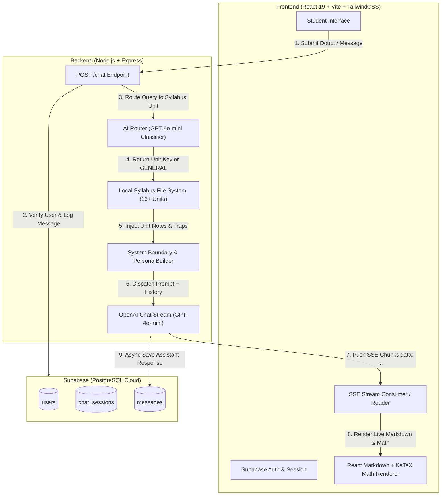

# 🚀 JEE AI — Intelligent AI Mentor & RAG Study Assistant for JEE Aspirants

<div align="center">

[](https://opensource.org/licenses/MIT)
[](https://nodejs.org/)
[](https://expressjs.com/)
[](https://react.dev/)
[](https://vitejs.dev/)
[](https://tailwindcss.com/)
[](https://supabase.com/)
[](https://platform.openai.com/)

**An end-to-end AI-powered tutoring ecosystem engineered specifically for IIT-JEE Main & Advanced aspirants.**  
*Combines low-latency AI routing, syllabus-grounded Retrieval-Augmented Generation (RAG), real-time Server-Sent Events (SSE) streaming, KaTeX LaTeX math rendering, and persistent session management.*

[Explore Features](#-key-features) • [Architecture](#-system-architecture) • [Quick Start](#-quick-start) • [API Reference](#-api-reference) • [Database Schema](#-database-schema) • [Product Requirements (PRD)](./PRD.md)

</div>

---

## 💡 The Problem & The Solution

Every year, over **1.4 million students** in India prepare for the Joint Entrance Examination (JEE Main & Advanced). Traditional coaching is expensive ($1,500 – $4,000/year), peer doubt clearance is inconsistent, and general-purpose LLMs (like standard ChatGPT) suffer from major pitfalls:
- They hallucinate complex college-level theory that isn't in the NCERT/JEE syllabus.
- They lack awareness of high-yield **"JEE Traps"**, standard test-taking shortcuts, and tricks.
- They render raw ASCII or broken LaTeX formulas that are hard to read on mobile.
- They speak in formal, dry, robotic textbooks rather than mentoring the student.

**JEE AI ("Bhaiya AI") solves this.** It acts as a 24/7 personal IITian mentor sitting right beside the student:
- **Strictly grounded in JEE syllabus notes** (Physical, Organic, and Inorganic Chemistry).
- **Streams real-time answers with instant LaTeX math formatting** ($E = -\frac{R_H}{n^2}$, reaction mechanisms, equilibrium constants).
- **Speaks with the "Bhaiya" persona** — relatable, high-energy, encouraging, and focused purely on exam score optimization.

---

## ✨ Key Features

### 🧠 1. Two-Tier AI Routing & Retrieval-Augmented Generation (RAG)
- **Zero-Latency Intent Classification**: When a query hits `/chat`, a lightning-fast classifier (`gpt-4o-mini`, temperature 0) categorizes the query into one of 16+ JEE Chemistry syllabus units (e.g., `chem_unit4_thermodynamics`, `chem_unit12_coordination`) or marks it as `GENERAL`.
- **Dynamic Context Injection**: Only the verified syllabus document corresponding to that unit is read and injected into the system prompt. This drastically reduces prompt token bloat while guaranteeing 100% syllabus alignment.

### ⚡ 2. Real-Time Token Streaming via SSE (Server-Sent Events)
- Sub-second Time-to-First-Token (TTFT) using HTTP `text/event-stream`.
- Students don't wait 10 seconds staring at a spinner — mathematical derivations and reaction steps stream onto the screen chunk by chunk.

### 🧮 3. Native LaTeX Math & Chemical Equation Rendering
- Built with `remark-math` and `rehype-katex` over `react-markdown`.
- Supports inline math (`$...$`) and block equations (`$$...$$`), fractions, integrals, matrices, chemical formulas, and thermodynamic notation without rendering glitch.

### 🎓 4. High-Energy "Bhaiya" Mentor Persona
- Configured through custom prompt engineering (`v4_boundary_prompt.txt`).
- Avoids generic textbook phrasing. Delivers intuitive analogies, highlights common exam traps, calls out high-weightage topics, and keeps students motivated when fatigued.

### 🔐 5. Full Persistence & Cloud Sync (Supabase)
- **User Authentication**: Secure email & password auth via Supabase.
- **Session History & Organization**: Multi-chat support, chat pinning, title renaming, and auto-deletion cascades.
- **Asynchronous Auto-Titling**: The server automatically synthesizes a concise 3-word title after the first user question without blocking the streaming response.
- **Study Gamification**: Tracks target exam year (2025/2026/2027), active day streaks, and dynamic exam countdown clock.

---

## 🏛️ System Architecture



---

## 🛠️ Tech Stack

| Domain | Technology | Description |
|---|---|---|
| **Frontend Framework** | [React 19](https://react.dev/) | Component architecture, responsive chat interface |
| **Bundler / Dev Server** | [Vite 8](https://vitejs.dev/) | Instant HMR and optimized production bundling |
| **Styling** | [Tailwind CSS v4](https://tailwindcss.com/) | Modern utility-first responsive layout with dark-mode aesthetic |
| **Math & Markdown** | `react-markdown`, `remark-math`, `rehype-katex`, `katex` | Flawless inline & display LaTeX math & chemistry formulas |
| **Icons** | [Lucide React](https://lucide.dev/) | Clean, accessible UI iconography |
| **Backend Runtime** | [Node.js](https://nodejs.org/) (ES Modules) | High-throughput asynchronous runtime |
| **Server Framework** | [Express.js](https://expressjs.com/) | REST API & Server-Sent Events (SSE) streaming engine |
| **Database & Auth** | [Supabase](https://supabase.com/) | PostgreSQL database, Row-Level Security, Auth engine |
| **AI LLM Engine** | [OpenAI API](https://platform.openai.com/) | `gpt-4o-mini` for fast intent classification and streaming mentorship |
| **Environment Config** | `dotenv` | Secure environment variable isolation |

---

## 📁 Repository Structure

```
JEE-AI/
├── index.js                     # Main Express server, SSE streaming, AI Router
├── package.json                 # Backend dependencies and scripts
├── .env.example                 # Root environment variable template
├── how_to_build_this.md         # Comprehensive engineering & architectural guide
├── my_engineering_brain.md      # System design decisions & trade-offs
├── future_roadmap.md            # Upcoming features & scaling strategy
├── PRD.md                       # Comprehensive Product Requirements Document
│
├── frontend/                    # Complete React client application
│   ├── src/
│   │   ├── App.jsx              # Main Chat UI, state management, SSE client
│   │   ├── main.jsx             # React DOM entry point
│   │   ├── supabaseClient.js    # Supabase browser client initialization
│   │   ├── index.css            # Tailwind CSS styling and theme
│   │   └── App.css              # Custom animations and scrollbar rules
│   ├── package.json             # Frontend dependencies
│   ├── vite.config.js           # Vite configuration
│   └── .env.example             # Frontend environment variable template
│
├── prompt_engineering/          # Persona & guardrail configurations
│   ├── v4_boundary_prompt.txt   # Master "Bhaiya" mentor system prompt
│   └── master_prompt_draft.txt  # Iterative prompt test drafts
│
├── syllabus_docs/               # Curated JEE Chemistry reference material
│   ├── chem_unit1_basic_concepts.txt
│   ├── chem_unit2_atomic_structure.txt
│   ├── chem_unit3_chemical_bonding.txt
│   ├── chem_unit4_thermodynamics.txt
│   ├── chem_unit5_solutions.txt
│   ├── chem_unit6_equilibrium.txt
│   ├── chem_unit7_electrochemistry.txt
│   ├── chem_unit8_kinetics.txt
│   ├── chem_unit9_periodic_table.txt
│   ├── chem_unit10_pblock.txt
│   ├── chem_unit11_dfblock.txt
│   ├── chem_unit12_coordination.txt
│   ├── chem_unit13_14_organic_basics.txt
│   ├── chem_unit15_hydrocarbons.txt
│   ├── chem_unit16_17_18_functional_organic.txt
│   └── chem_unit19_20_biomolecules_practical.txt
│
└── data/                        # Supplementary datasets & test fixtures
```

---

## ⚡ Quick Start

### 1. Prerequisites
- **Node.js** (v18.0.0 or higher)
- **npm** (v9.0.0 or higher)
- An **OpenAI API Key** (from [OpenAI Platform](https://platform.openai.com/api-keys))
- A free **Supabase Project** (from [Supabase Dashboard](https://supabase.com/))

---

### 2. Clone the Repository

```bash
git clone https://github.com/Vedant1922/Entereance-exam-prep-AI.git
cd Entereance-exam-prep-AI
```

---

### 3. Backend Setup

1. Install root dependencies:
   ```bash
   npm install
   ```

2. Create your `.env` file in the root directory:
   ```bash
   cp .env.example .env
   ```

3. Populate `.env` with your credentials:
   ```env
   PORT=3000
   OPENAI_API_KEY=sk-proj-xxxxxxxxxxxxxxxxxxxxxxxx
   SUPABASE_URL=https://your-project-id.supabase.co
   SUPABASE_ANON_KEY=eyJhbGciOi...xxxxxxxx
   ```

4. Start the backend server:
   ```bash
   npm start
   ```
   *The server starts listening on `http://localhost:3000`.*

---

### 4. Database Setup (Supabase SQL)

Go to your **Supabase Dashboard → SQL Editor** and execute the following SQL script to set up your tables and cascade relationships:

```sql
-- 1. Users Table
CREATE TABLE users (
  id UUID PRIMARY KEY,
  email TEXT,
  exam_year TEXT DEFAULT '2026',
  study_streak INTEGER DEFAULT 0,
  created_at TIMESTAMPTZ DEFAULT now()
);

-- 2. Chat Sessions Table
CREATE TABLE chat_sessions (
  id UUID PRIMARY KEY DEFAULT gen_random_uuid(),
  user_id UUID REFERENCES users(id) ON DELETE CASCADE,
  title TEXT DEFAULT 'New Chat',
  subject TEXT DEFAULT 'CHEMISTRY',
  is_pinned BOOLEAN DEFAULT false,
  created_at TIMESTAMPTZ DEFAULT now(),
  updated_at TIMESTAMPTZ DEFAULT now()
);

-- 3. Messages Table
CREATE TABLE messages (
  id UUID PRIMARY KEY DEFAULT gen_random_uuid(),
  session_id UUID REFERENCES chat_sessions(id) ON DELETE CASCADE,
  role TEXT NOT NULL,
  content TEXT NOT NULL,
  created_at TIMESTAMPTZ DEFAULT now()
);
```

---

### 5. Frontend Setup

1. Open a new terminal tab and navigate into `frontend/`:
   ```bash
   cd frontend
   npm install
   ```

2. Create your `frontend/.env` file:
   ```bash
   cp .env.example .env
   ```

3. Populate `frontend/.env`:
   ```env
   VITE_SUPABASE_URL=https://your-project-id.supabase.co
   VITE_SUPABASE_ANON_KEY=eyJhbGciOi...xxxxxxxx
   ```

4. Run the Vite development server:
   ```bash
   npm run dev
   ```

5. Open your browser at `http://localhost:5173`. Register an account or sign in, select your target exam year, and start asking questions!

---

## 📡 API Reference

### `POST /chat`

Initiates an AI tutor conversation and streams tokens via Server-Sent Events (SSE).

#### Request Headers
```http
Content-Type: application/json
```

#### Request Body
```json
{
  "message": "Can you explain Le Chatelier's principle and how pressure affects equilibrium?",
  "history": [
    { "role": "user", "content": "Hello!" },
    { "role": "assistant", "content": "Hey! Ready to solve some chemistry?" }
  ],
  "userId": "d3b07384-d113-49d7-8c34-8c8577543888",
  "userEmail": "student@example.com",
  "sessionId": "a7e1488c-e659-4b6e-8260-6c9c676d4df9",
  "subject": "CHEMISTRY"
}
```

#### Response Stream (Server-Sent Events)
```http
HTTP/1.1 200 OK
Content-Type: text/event-stream
Cache-Control: no-cache
Connection: keep-alive

data: {"sessionId":"a7e1488c-e659-4b6e-8260-6c9c676d4df9"}

data: {"chunk":"Listen carefully! 🎯 "}

data: {"chunk":"Le Chatelier's Principle states that when a system at equilibrium is disturbed, "}

data: {"chunk":"the system shifts in a direction that opposes that disturbance."}

...

data: [DONE]
```

---

## 🧪 Chemistry Syllabus Coverage

The RAG knowledge base includes 16 curated unit modules covering all high-frequency topics:

| Branch | Unit Identifier | Core Topics Included |
|---|---|---|
| **Physical Chemistry** | `chem_unit1_basic_concepts` | Mole concept, empirical formulas, stoichiometry, molarity/molality |
| | `chem_unit2_atomic_structure` | Bohr model, de Broglie, quantum numbers, electronic configuration |
| | `chem_unit3_chemical_bonding` | VSEPR, hybridization, dipole moment, MO theory |
| | `chem_unit4_thermodynamics` | First/Second Law, enthalpy, entropy, Gibbs free energy ($\Delta G^\circ$) |
| | `chem_unit5_solutions` | Raoult's law, colligative properties, van 't Hoff factor |
| | `chem_unit6_equilibrium` | $K_c$, $K_p$, Le Chatelier's principle, buffer solutions, solubility product |
| | `chem_unit7_electrochemistry` | Nernst equation, conductance, Kohlrausch law, Faraday's laws |
| | `chem_unit8_kinetics` | Rate laws, Arrhenius equation, half-life, collision theory |
| **Inorganic Chemistry** | `chem_unit9_periodic_table` | Periodic trends (IE, EA, EN, radii), screening effects |
| | `chem_unit10_pblock` | Group 13 to 18 anomalies, structures of oxyacids |
| | `chem_unit11_dfblock` | Transition metals, lanthanoid contraction, oxidation states |
| | `chem_unit12_coordination` | Werner theory, IUPAC naming, CFT, isomerism, spectrochemical series |
| **Organic Chemistry** | `chem_unit13_14_organic_basics`| Inductive, electromeric, resonance, hyperconjugation, isomerism |
| | `chem_unit15_hydrocarbons` | Alkanes, alkenes, alkynes, aromaticity, Markovnikov addition |
| | `chem_unit16_17_18_functional_organic`| Alkyl halides, alcohols, carbonyl compounds, carboxylic derivatives |
| | `chem_unit19_20_biomolecules_practical`| Carbohydrates, amino acids, polymers, qualitative chemical analysis |

---

## 🔮 Future Roadmap

- [ ] **Multi-Exam Scaling**: Expand RAG vaults to support **NEET (Biology)** and **CUET**.
- [ ] **Mermaid.js Flowcharts**: Code-based dynamic reaction mechanism diagrams generated directly in markdown at zero image generation cost.
- [ ] **Adaptive PYQ Mock Generator**: Automatically analyze student weakness logs from chat history and generate custom 20-question practice quizzes.
- [ ] **Interactive Visual Simulators**: Generative UI widgets for Rotational Dynamics and Projectile Motion.
- [ ] **Voice Interaction**: WebRTC/Whisper voice input and speech synthesis for conversational study on mobile.

---

## 🤝 Contributing

Contributions are welcome! Please follow these steps:
1. Fork the Project
2. Create your Feature Branch (`git checkout -b feature/AmazingFeature`)
3. Commit your Changes (`git commit -m 'Add some AmazingFeature'`)
4. Push to the Branch (`git push origin feature/AmazingFeature`)
5. Open a Pull Request

---

## 📄 License

Distributed under the **MIT License**. See `LICENSE` for more information.

---

<div align="center">

**Built with ❤️ for every student striving to crack IIT-JEE.**  
*Created by [Vedant1922](https://github.com/Vedant1922)*

</div>
